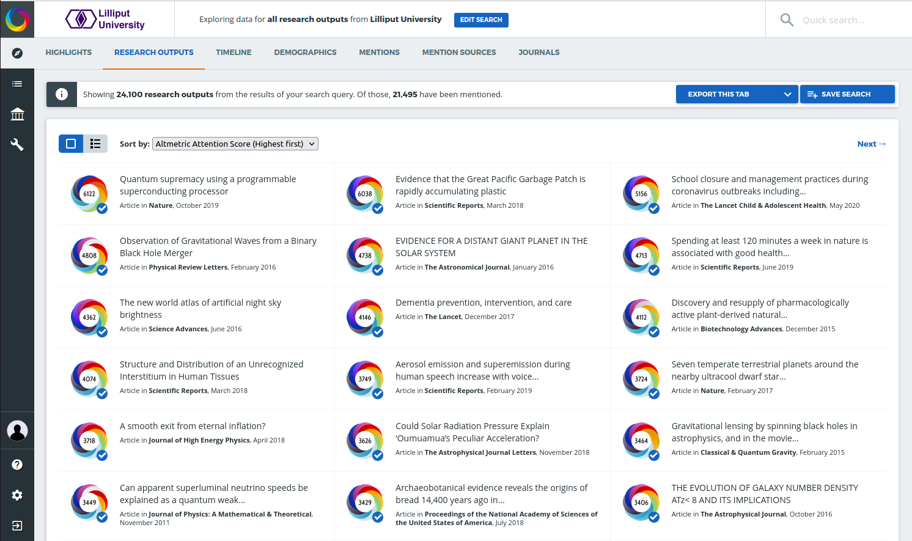

Co-branding your Explorer for Institutions instance
***************************************************
During the implementation of Explorer for Institutions, you will be able to add your logo to ensure your users know the database is supported by your institution.

See below for an example logo in the top-right corner of Explorer for Institutions:

We will collect your logo during the implementation, please note that the logo must fit these diameters: 300px × 80px PNG, no larger than 30KB.