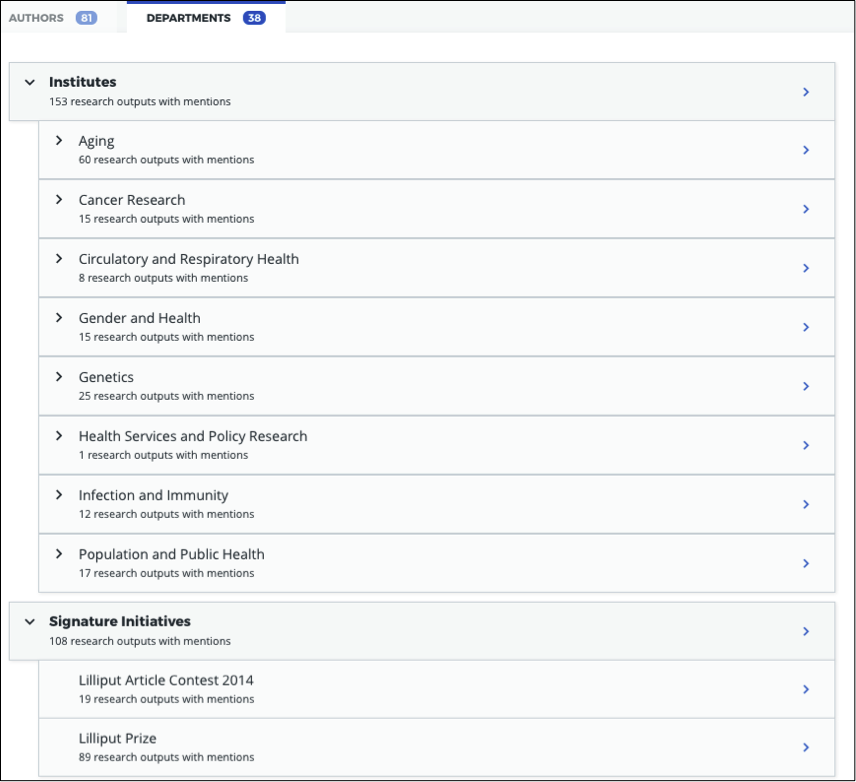

Overview
********
Altmetric collects attention data for outputs that have been mentioned online across a range of sources. As items in the Altmetric database are not organized by institution, 
we can integrate with third party systems or allow for a manual CSV upload in order to set up your institutional edition of |efi|, with outputs produced by your own authors and departments. 

We will then populate |efi| by linking your set of publications, authors and departments with the scholarly publications already tracked in the Altmetric database. This enables you to browse the altmetrics of your institutional outputs by your institutional authors and departments.

Connecting to your Research Information Management System
*********************************************************
Implementation involves granting API access to Altmetric, so that |efi| can be automatically populated with the relevant publication, author and departmental data. 

Symplectic Elements
===================
If your institution uses Symplectic Elements, Altmetric is able to easily provide a seamless link between Elements and |efi|. Currently, Altmetric can connect to Symplectic Elements v5.5, or a more recent version. 

Instructions are detailed below on establishing the connection between |efi| and your instance of Symplectic Elements.

Administrator instructions for Elements
---------------------------------------
Please follow the instructions below to set up your Elements API for Altmetric.

Open a port
^^^^^^^^^^^
You'll first need to  open a port in your firewall to allow access to your Elements API, to do this you'll need to find an available port. 

To see the ports currently in use run this from a command line: 

``netstat -an | find /i "listening"``

Assign an SSL certificate
^^^^^^^^^^^^^^^^^^^^^^^^^
Next you'll need to take the thumbprint and assign a valid SSL certificate to your chosen port. Replace the ``<port number>`` and ``<thumbprint>`` before running this from a command line:

``netsh http add sslcert ipport=0.0.0.0:<port number> certhash=<thumbprint> appid={00112233-4455-6677-8899-AABBCCDDEEFF}``

Run this to see if your port is now listed: 

``netsh http show sslcert``

.. important::
    Whilst Altmetric does not require Elements to be access over SSL it's **highly recommended** that it is. Using SSL is a good way to ensure your data is sent securely to our servers, without SSL we will pull your data across the network in plain text. Note that even without SSL, no sensitive employee information is ever sent to Altmetric.

Add API endpoint
^^^^^^^^^^^^^^^^
Next you'll need to add an API endpoint. System administrators can configure the Elements API in the **Manage API** area under **System Admin**. 

Add a new API endpoint on the API Endpoints page with the following details:

- **Compatibility:** Standard 4.9
- **Scheme:** HTTPS (Secure)
- **Port:** as set up above
- **Path:** for example: ``elements-api-altmetric``

This will create an endpoint with address like: ``https://<host>:<port number>/elements-api-altmetric``.

Ensure that it is enabled and then update the page.

Add Altmetric as external system with allowed access
^^^^^^^^^^^^^^^^^^^^^^^^^^^^^^^^^^^^^^^^^^^^^^^^^^^^
Add Altmetric's required IP ranges on the API Configuration page:

**Live:** ``164.132.63.174``

**Staging:** ``51.254.16.223``

.. hint::
  
  Adding both IP ranges to your Elements production instance allows us to test your import via our staging (development) server and then launch on our live server.

Add an API Account for Altmetric
^^^^^^^^^^^^^^^^^^^^^^^^^^^^^^^^
Set up login credentials for Altmetric. Add a new API account for Altmetric to be able to connect to the API endpoint using credentials: 

- **Username** : altmetric
- **Password** : [set to a secure password]
- **Account rights** : none

Make sure you set the password to something secure.

Restart API under **Scheduled Jobs** .

Send Altmetric your API details and credentials
^^^^^^^^^^^^^^^^^^^^^^^^^^^^^^^^^^^^^^^^^^^^^^^
Once you have enabled access to your Symplectic Elements API endpoint (and provided access for both live and staging servers), please securely send the following to your |implementation-contact|:

 - The API endpoint you set up
 - The login credentials

You will hear back from your |implementation-contact| about whether or not the connection with your Symplectic Elements API endpoint, was successful. Once the connection has been confirmed to be successful, we will schedule your implementation in order to begin pulling in your publications data from Symplectic Elements.

Object privacy settings for Elements
------------------------------------
In version 6.2, Symplectic introduced a more extensive privacy framework that allowed objects/items to be set as **private** , **internal** or **public**. The integration we have with Elements can be configured to apply these same familiar privacy concepts to your |efi| giving you full control of how your data is shared with us. 

You can read more about object privacy for Element 6.2 and above `here <https://support.symplectic.co.uk/support/solutions/articles/6000246835-introducing-object-privacy-v6-2-onwards->`_.

Synchronizing objects based on their privacy level is available at the following restrictive levels:
  
  - **Public** - We will only import **public** user profiles, research outputs and relationships
  - **Public and Internal** - We will only import **public** and **internal** user profiles, research outputs and relationships

Objects and relationships that are set as **Private** won't ever appear in the Explorer. 

Your |implementation-contact| will discus these configuration options with during onboarding. If you're an existing Altmetric customer and would like to customize your existing configuration settings please contact support@altmetric.com.

.. warning ::

  If you're using a version of Elements prior to 6.2 all objects **except** private relationships will be imported. For information on data privacy in Elements prior to v6.2 please see:

    - `Introduction to Data Privacy and Personal Data in Elements (v5.12 onward) <https://support.symplectic.co.uk/support/solutions/articles/6000189182-introduction-to-data-privacy-and-personal-data-in-elements-v5-12-onward->`_
    - `Previous Changes to Data Privacy by Elements Version <https://support.symplectic.co.uk/support/solutions/articles/6000188846-previous-changes-to-data-privacy-by-elements-version>`_

Controlling what objects are included in your |efi|
---------------------------------------------------
As well being able to choose what object privacy levels are synchronized with your |efi| we also provide you with additional options to include/exclude certain user status' and user profile types.

  - **User status** - Importing users can be configured to synchronize either **All users** or to only allow **Current users**.
  - **User profile type** - Importing users based on their profile type can be configured to synchronize either **All users**, **Academic or student users** or just **Academic users** only.

Your |implementation-contact| will discus these configuration options with during onboarding. If you're an existing Altmetric customer and would like to customize your existing configuration settings please contact support@altmetric.com.

.. note ::

  Changes to your |efi| configuration will trigger a reset and full import of your Elements data. Depending on the size of your institution it may take **several** days to complete.

Pure
====
Altmetric can integrate with Pure in order to set up your institutional edition of |efi|, allowing you to view your institution's publication outputs, authors, and departments within the Explorer. We populate the |efi| by linking your set of publications, authors and departments with the scholarly publications already tracked in the Altmetric database.

Please follow the instructions below to set up your Pure API for Altmetric.

Administator instructions for Pure
-----------------------------------
Allow access through your firewall
^^^^^^^^^^^^^^^^^^^^^^^^^^^^^^^^^^
If you have a firewall, ensure you have opened a port that would allow our IP addresses to access as detailed below.

**Live:** ``164.132.63.174``

**Staging:** ``51.254.16.223``

.. hint::
  
  Adding both IP ranges to your Elements production instance allows us to test your import via our staging (development) server and then launch on our live server.

Create an API key and allow access to required endpoints
^^^^^^^^^^^^^^^^^^^^^^^^^^^^^^^^^^^^^^^^^^^^^^^^^^^^^^^^
- ``/research-outputs`` - we harvest identifiers associated with your publications from this endpoint, as well as publication-authors and publication-departments associations for each publication
- ``/persons`` - we harvest author names and author-departments associations from this endpoint
- ``/organisational-units`` - we harvest department names and parent departments from this endpoint so we can use it to build your departmental hierarchy
- ``/changes`` - this endpoint alerts us to any creation, update and deletion changes to publications, and update and deletion changes to authors.

.. note::
  
  If preferred, you can also set up login credentials for Altmetric. Just provide these credentials to your |implementation-contact| in a secure way at the same time as the endpoint and API key.

Provide Altmetric with access to your Pure API endpoint
^^^^^^^^^^^^^^^^^^^^^^^^^^^^^^^^^^^^^^^^^^^^^^^^^^^^^^^
Once you have enabled access to your API endpoint please securely provide the following information to your |implementation-contact|:

- Your Pure API endpoint, e.g., in a format like: https://pure.university.ac.uk/ws/rest/
- An API key with access to all **four** above-named endpoints
- Login credentials for Altmetric, if required

That's it! You will hear back from your |implementation-contact| about whether or not the connection with your Pure API endpoint was successful.

Send your publications data via CSV spreadsheet
***********************************************
You can populate |efi| via a CSV spreadsheet detailing your author, publications and group/department data. Altmetric require two CSV files to populate your instance:

- A Publications file listing your author names, publication identifiers (e.g. DOIs, PMIDs, etc.) and group/department affiliation for each item
- An Organizational hierarchy file detailing your groups structure to populate the Departments tab in the Explorer. We create this structure to help you browse sets of publications in groups that make sense for your organization. This might be your university hierarchy or groupings such as open access status; funding award; grant ID; therapeutic area; animal type; health conditions; subjects, etc. The key thing is your groups are relevant to how you would like to report on Altmetric data.

Preparing your publications file
================================
At minimum, we will need a file with three columns, containing the information shown below. Here's an example of the minimum required data in a CSV:

.. list-table::
   :widths: 33 33 33
   :header-rows: 1

   * - Author
     - Department
     - DOI
   * - Carberry, Josiah
     - School of Pottery
     - 10.1234/psycer123
   * - Row 2, column 1
     - Row 2, column 2
     - Row 2, column 3
		
Each row of this file should always correspond to:

- Author names (with more than one author name separated by semicolon)
- Department/groups associated with each publication (with more than one department/group separated by semicolon)
- Publication identifiers

.. hint::

  If you are using a semi-colon to provide multiple values per colum don't double quote the column itself as this can lead to unexpected results. Simply wrap the individual name in quotes ,for example:
  ``"Carberry,Josiah";"Brush,Painter"`` instead of ``"Carberry,Josiah;Brush,Painter"``.

We use this data to populate publications, authors and department/groups in |efi|. Here is a larger sample data set, with multiple IDs per item:

.. list-table::
   :widths: 20 20 20 20 20
   :header-rows: 1

   * - Author
     - Department
     - DOI
     - PMID
     - arXiv
   * - Carberry, Josiah
     - School of Pottery
     - 10.1234/psycer123
     -  
     - 
   * - Carberry, Josiah
     - Department of Biological Sciences
     - 10.1234/psycer123
     - 
     -   
   * - Carberry, Josiah
     - Department of Biological Sciences
     - 10.1234/humkh456
     - 65436
     -  
   * - Carberry, Josiah
     - Department of Biological Sciences
     - 10.1234/biolog789
     - 4567
     -  
   * - Brush, Painter
     - Department of Applied Economics
     - 10.1234/painter444
     - 12345
     -  
   * - Brush, Painter
     - Department of Applied Economics
     - 10.1234/psycer123
     - 23467
     - 1000.1
   * - Science, Simon
     - Department of Theatre and TV Studies
     - 10.6574/tv984213
     -  
     - 
   * - Smith, John
     - Department of Environmental Sciences
     - 10.1234/biolo123
     -  
     - 
   * - Thomas, Eve; Jones, Peter; Willis, Sarah
     - Lilliput Urban Cities Research Centre
     - 10.9874/hou345
     -  
     - 
	 	 		
The author and departmental affiliation(s) should correspond with an individual output. On a single row representing a single research output, you can list multiple authors separated by semicolon in "Lastname, Firstname" format (as seen in the bottom row above). 

Please list each type of identifier in its own column, and don't mix and match the DOIs and PMIDs (or other types of identifiers) within a single column. You should include both types of identifier whenever possible. 

The department information should match the group names in your hierarchy CSV and not include duplicates. 

A list of supported identifiers can be found in the :ref:`Supported identifiers` section.

Providing group information in your publications file for organizations without a traditional hierarchy structure
=================================================================================================================
You can add multiple sections in your hierarchy if you would like to browse by different categories, e.g. Geography and Therapeutic Area.

Here is a publications file example for organizations with multiple group types:

.. list-table::
   :widths: 20 20 20 20 20
   :header-rows: 1

   * - Author
     - DOI
     - PMID
     - Geography
     - Therapeutic Area
   * - Carberry, Josiah
     - 10.1234/psycer123
     - 65436
     - United States 
     - Hematology
   * - Carberry, Josiah
     - 10.1234/psycer123
     - 4567
     - United States
     - Hematology  
   * - Brush, Painter
     - 10.1234/painter444
     - 12345
     - United States
     - Multiple Sclerosis
   * - Brush, Painter
     - 10.1234/psycer123
     - 23467
     - United States
     - Multiple Sclerosis
   * - Science, Simon
     - 10.6574/tv984213
     - 
     - United States 
     - Multiple Sclerosis
   * - Smith, John
     - 10.1234/biolo123
     - 
     - United States 
     - Multiple Sclerosis

In the above example, you can see the file includes multiple identifiers for some items and each output appears in multiple groups. E.g., the first output (DOI: 10.1234/humkh456), also has a PMID of 65436 and is associated with two groups in the departmental hierarchy: United States and Hematology. 

This output will therefore be discoverable via both identifiers and via the **Geography** > **United States** / **Therapeutic Area** > **Hematology group** .

Multiple co-authors from the same institution
=============================================
If there are multiple co-authors of the same paper who all belong to the same institution, you can either list each author in a separate row or separate them by semi-colons.

The authors in your CSV should belong to your institution only; you should not include any co-authors who do not belong to your institution. Example of one article with co-authors from the same institution:

.. list-table::
   :widths: 20 20 20 20 20
   :header-rows: 1

   * - Author
     - Department
     - DOI
     - PMID
     - arXiv
   * - Carberry, Josiah
     - School of Pottery
     - 10.1234/psycer123
     - 23467 
     - 1000.1000
   * - Brush, Painter
     - School of Painting
     - 10.1234/psycer123
     - 23467
     - 1000.1000  
   * - Science, Simon
     - School of Biology
     - 10.1234/psycer123
     - 23467
     - 1000.1000

If all authors belong in the same departments, you can add them as shown below:

.. list-table::
   :widths: 20 20 20 20 20
   :header-rows: 1

   * - Author
     - Department
     - DOI
     - PMID
     - arXiv
   * - Science, Simon; Brush, Painter; Carberry, Josiah
     - School of Biology; School of Painting; School of Pottery
     - 10.1234/psycer123
     - 23467 
     - 1000.1000

.. note:: 
  If one of the authors, e.g. Simon Science, only works in the School of Biology, they should not be included in the CSV in this way, they should have a separate row, even though it is the for the same paper.

Multiple departmental affiliations for a publication
====================================================
If a single publication belongs to multiple departments, please list the departmental affiliations in the same cell and separate the names using semi-colons. 

Example using semi-colons to separate departments:

.. list-table::
   :widths: 25 25 25 25
   :header-rows: 1

   * - Author
     - Department
     - DOI
     - PMID
   * - Carberry, Josiah
     - School of Pottery; School of Painting
     - 10.1234/psycer123
     - 23467 
   * - Science, Simon
     - School of Biology; School of Neuroscience; School of Biochemistry
     - 10.1234/biolo123
     -  

Organizational hierarchy: building your departments/groups structure
====================================================================
In order to browse your data by department or group, you will need to provide the structure of your departments/groups in a separate spreadsheet. Each level in the hierarchy should be listed in a separate column. This creates a section in the Explorer *Departments* view. A Level 1 group will be a new section, with its Level 2 groups associated as children. Column A should always contain the name of your organization - a *Top Level* department which won't appear in the Explorer. See below for examples in |efi| and as CSV spreadsheets. Please note: the department names must match the group names in your publications spreadsheet and not include duplicates.

a) **University/research institution hierarchy example** Here's an example of a university departmental hierarchy in |efi|:

Here's how this hierarchy is structured in the CSV spreadsheet:

b) **Funder hierarchy example** Here's an example of a funder departmental hierarchy in |efi|:

Here's how this hierarchy is structured in the CSV spreadsheet (with parent departments bolded for emphasis):

.. image:: assets/example-csv-screenshot-funder.png
  :alt: The institutional CSV file is split into three columns, top level (the name of the funder), level 1 (funding area) and level 2 (research type)

c) **Pharmaceutical hierarchy example** Here's an example of a pharmaceutical departmental hierarchy in |efi|: 

.. image:: assets/Pharma-EFI.png 
  :alt: Example of a pharmaceutical departmental hierarchy showing groupings by geography and therapeutic area

Here's how this hierarchy is structured in the CSV spreadsheet:

Supported identifiers
=====================
|efi| supports the following unique identifiers via CSV import:

- DOI
- PubMed ID
- NCT ID
- RePeC ID
- arXiv ID
- ADS Bibcode
- Handle
- URN
- ISBN
- URI (custom service for supported domains only)

For each identifier type you want to use, please ensure that each of those types is listed in its own column.

Final steps
===========
As soon as your data file is complete send it to your |implementation-contact|. Check you have included the following:

- Publications CSV file
- Groups CSV file

Please use the instructions above to prepare your data and let us know if you have any questions. We will be happy to check this data for you and let you know if there are any issues, before walking you through how to upload the CSVs to your instance.

Keeping your data up-to-date via spreadsheet
============================================
Using the CSV uploader tool, one or more administrators at your organization can maintain the data integration by uploading new CSVs each time you wish to add, remove, or alter publications or departments. 
During the implementation process, we will establish who at your organization will be designated as an administrator; they will have access to the CSV tool and the administrator's panel. Training will
be provided for any individuals who are designated administrators. 

Documentation about the CSV tool can be found in the Support Portal `here <https://help.altmetric.com/support/solutions/articles/6000240718-csv-uploader-tool-preparing-the-data>`_.

Harvesting from your repository OAI-PMH feed
********************************************
If your institution uses an institutional repository with an OAI-PMH feed, e.g. EPrints, DSpace or bepress, Altmetric can populate your instance of |efi| using your repository data. This enables us to import your institutional authors, groups and organizational hierarchy from your institutional repository to |efi|, and update your data automatically. 

If you have a non-traditional structure to your institutional hierarchy please read this additional `information <https://help.altmetric.com/a/solutions/articles/6000258260?portalId=6000060531>`_.

Preparing your repository for an EFI integration
================================================
A number of metadata fields should be exposed via your OAI-PMH feed in order for Altmetric to collect all the relevant data from your repository and populate EFI. Instructions are detailed below.

Provide your OAI-PMH endpoint
-----------------------------
Firstly, we need the base URL for your repository OAI-PMH endpoint, e.g.: http://eprints.lse.ac.uk/cgi/oai2 Altmetric will import your data via this endpoint.

Publications and identifiers
----------------------------
Next, Altmetric will import publications from your OAI-PMH feed, usually via a URL like this: http://eprints.lse.ac.uk/cgi/oai2?verb=ListRecords&metadataPrefix=oai_dc Altmetric collects identifiers from the OAI record for each item. Only records that have a supported identifier will be imported so ensure that all of your records have unique persistent identifiers (e.g. DOI, Handle, ISBN), and those identifier fields are available via the OAI-PMH feed. 

.. warning::
  We're only able to import items with persistent identifiers.

Authors
-------
Altmetric needs to know which authors are associated with your institution in order to populate the **Authors** tab in |efi|. In order to set this up, you need to expose an institutional author ID via your OAI-PMH feed. 

This could be a unique value for each institutional author, such as an ORCID iD, institutional identifier or email address. See the example below:

.. code-block:: xml

  <record>
    <header>
      <identifier>oai:gala.gre.ac.uk:1</identifier>
      <datestamp>2016-10-14T08:58:54Z</datestamp>
    </header>
    <metadata>
      <oai_dc:dc xmlns:oai_dc="http://www.openarchives.org/OAI/2.0/oai_dc/" xmlns:dc="http://purl.org/dc/elements/1.1/" xsi:schemaLocation="http://www.openarchives.org/OAI/2.0/oai_dc/ http: www.openarchives.org OAI 2.0 oai_dc.xsd" xmlns:xsi="http://www.w3.org/2001/XMLSchema-instance">
      <dc:title>A natural extension of the conventional finite volume method into polygonal unstructured meshes for CFD application.</dc:title>
      <dc:creator id="koulis@glasgow.uk">Pericleous, Koulis A.<dc:creator>
      <dc:creator id="1234">Cross, Mark<dc:creator>
      <dc:subject>TA Engineering (General). Civil engineering (General)</dc:subject>
      <dc:description>A new general cell-centered solution procedure.</dc:description>
      <dc:publisher>Elsevier</dc:publisher>
      <dc:date>1996-02</dc:date>
      <dc:type>Article</dc:type>
      <dc:type>PeerReviewed</dc:type>
      <dc:identifier>http://hdl.handle.net/10568/54297</dc:identifier>
    </oai_dc:dc>
  </metadata>
  </record>

From the source code above, we collect the authors from the ``dc:creator`` tags:

.. code-block:: xml

  <dc:creator id="koulis@glasgow.uk">Pericleous, Koulis A.</dc:creator>
  <dc:creator id="1234">Cross, Mark</dc:creator>

The unique ``id`` for the first institutional author would be "koulis@glasgow.uk", and for the second author it would be "1234". This enables searching for these authors in the |efI| view.

.. important::

  Harvesting authors based on institutional affiliation is only available for certain OAI-MPH feeds / metadata prefixes - for further information please contact Support who will be happy to discuss this with you. 

Hierarchy
---------
Altmetric recreates your organizational hierarchy from your institutional repository in order to populate the Departments tab in |efi|. Groups should be available in the OAI-PMH feed, as detailed in the ``ListSets`` example below: http://eprints.lse.ac.uk/cgi/oai2?verb=ListSets. 

The sets created should replicate your browse by **Division/Group/Faculty** view in the front end of your repository.

DiVA Portal
^^^^^^^^^^^
If you are a DiVA Portal customer and are using our OAI-PMH integration with the ``swepub_mods`` metadata prefix we're able to offer you a number of ways to customize how departments are displayed within your |efi|. 

- **Translations/renaming** - It might be that you want to translate your department names from Swedish to English or simplify certain department names so that they're more easily identifiable for users.
- **Map papers to other departments** - It might be that your repository hierarchy is out of date or your institution has gone through a number of changes over the years and departments have merged or you want to simplify reporting.

If either of these requirements are something that you're interested in you can read more about translating/renaming departments `here <https://help.altmetric.com/a/solutions/articles/6000261793?portalId=6000060531>`_ and re-mapping papers `here <https://help.altmetric.com/a/solutions/articles/6000261794?portalId=6000060531>`_.

We are also able to filter out specific record types based on their ``setSpec``, for example as part of the synchronization process we're able to exclude all records that have the name ``studentThesis``.

Haplo
^^^^^
If you use Haplo for your repository then our integration will be configured to use the ``oai_datacite`` metadata prefix. This will enable us to specifically import authors that are affiliated with your institution.

DSpace
^^^^^^
If you use DSpace for your repository then you will need to ensure that the ``api/hierarchy`` endpoint is enabled as we build your hierarchical structure using this data and not from ``ListSets`` .

If you are unable to enable this endpoint we are able to offer a departmentless integration as an alternative.

Esploro
^^^^^^^
Esploro requires that a ``setSpec`` is always provided when harvesting records from your repository. This means that in order to sync over your research outputs and to replicate your departmental structure within your |efi| you will need to create publishing profiles for each department. If you are unable to to do this then we are able to offer a departmentless integration as an alternative. 

.. note::
  
  If you require a departmentless instance then because of the selective harvesting requirement  - a single publishing profile would still be required.

The Esploro repository also exposes a number of other profiles via ``ListSets``, for example **BrowZine** and **Unpaywall** . To exclude these from appearing within your |efi| you would be required to prefix the ``setName`` of all publishing profiles you **do** want to see with ``Department =`` as in the example below.

To have a department for the **Faculty of Science** for which there is a dependent department **School of Biology** - you will need a publishing profile for each which would result in the following ``ListSet`` records.
Because of the filtering applied using ``Department =`` the **BrowZine** wouldn't be synch'd.

.. code-block:: xml

  <ListSets>
    <set>
      <setSpec>Faculty of Science</setSpec>
      <setName>Department = Faculty of Science</setName>
    </set>
    <set>
      <setSpec>Faculty of Science:School of Biology</setSpec>
      <setName>Department = School of Biology</setName>
    </set>
    <set>
      <setSpec>BrowZine</setSpec>
      <setName>BrowZine</setName>
    </set>
  </ListSets>

This would result in the following structure within the Explorer.

Next steps
----------
Please ensure you have completed steps the above. When all changes are in place and the new fields are accessible via your institutional repository OAI-PMH feed, Altmetric are able to begin your |efi| implementation. During the implementation, we'll initially run a full import of your repository data and set up weekly automatic updates to import new/modified items.

Frequently asked questions
**************************

What happens after my data are imported into |efi|?
===================================================
After Altmetric connects with your system for the first time, an initial mass import of all your authors, publications, departments, etc. will be carried out. The authors, departments, and organizational hierarchy information will be used to populate the **Authors** and **Departments** tabs that can be found in **My institution**. 

Using the publications data you have supplied, Altmetric will retrieve any attention data it has stored in association with these particular publications. Thus, attention data for all scholarly articles in your 
institution will be automatically supplied once the connection is made. There is no further work required from you once you have provided Altmetric with access.

Do lists of authors, publications, and groups Altmetric stay in sync?
=====================================================================
Yes. All of the relevant data that Altmetric retrieves from your system are synced with |efi| on a regular basis. Updates or deletions of authors, publications or groups, etc. in your system will subsequently be reflected in |efi| after its latest sync.